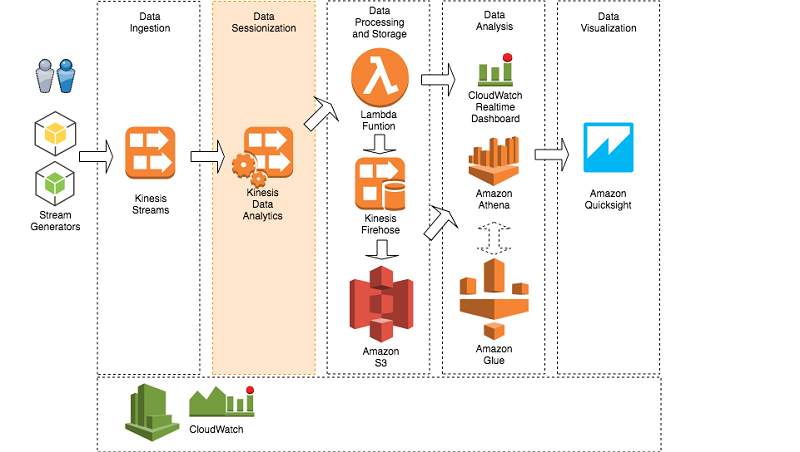
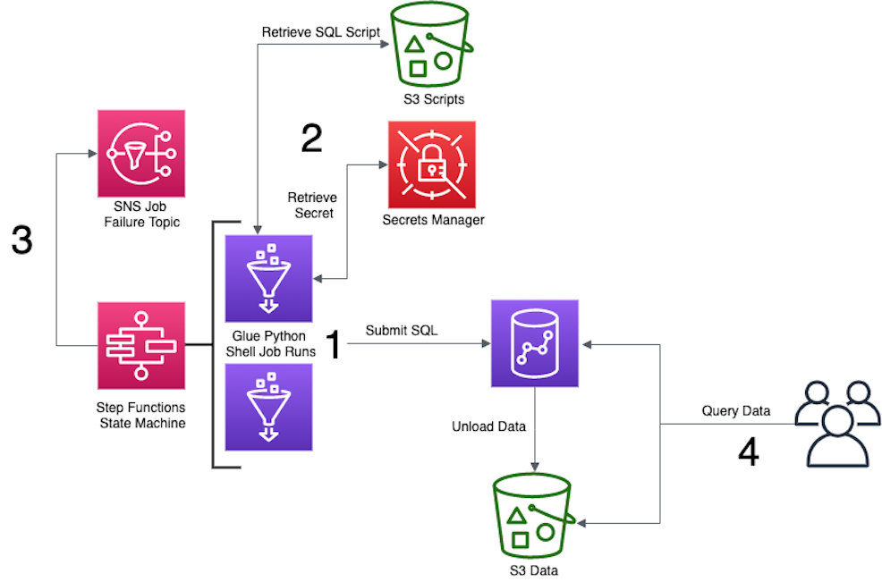
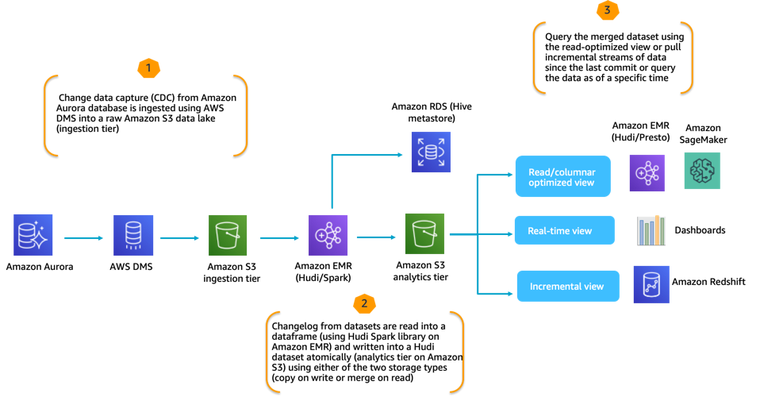
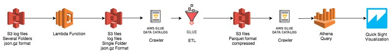
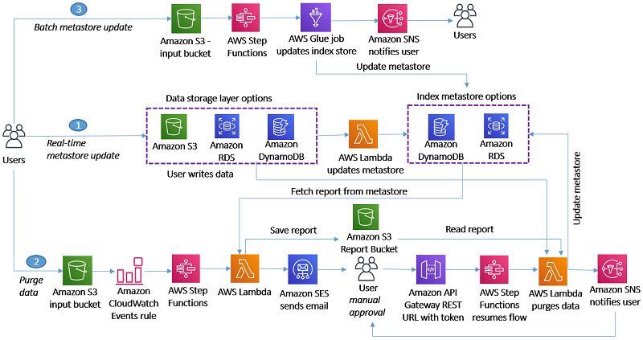
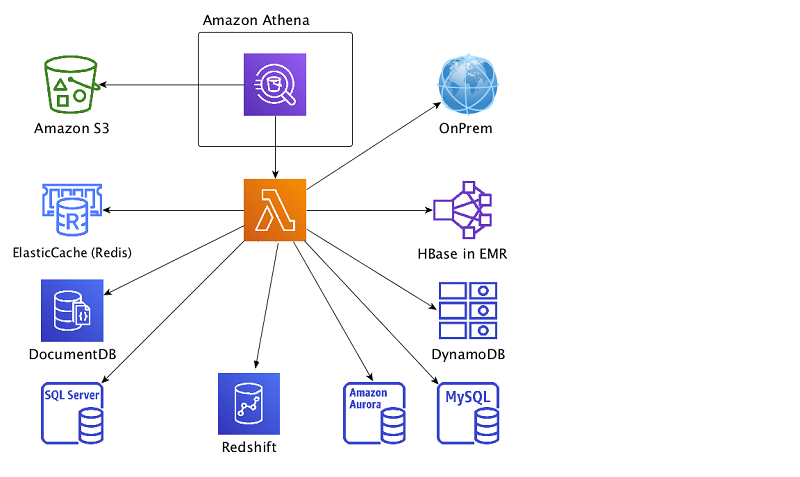
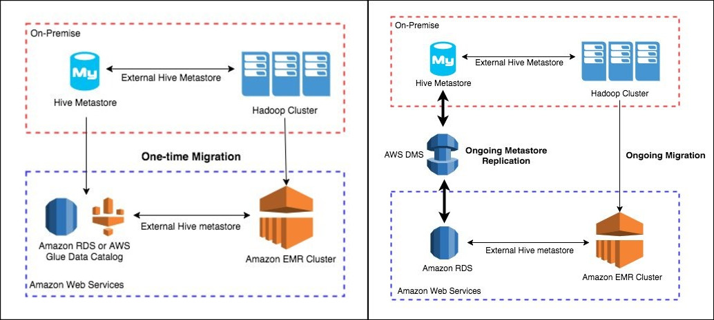
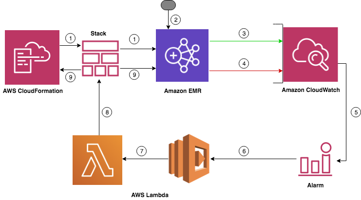
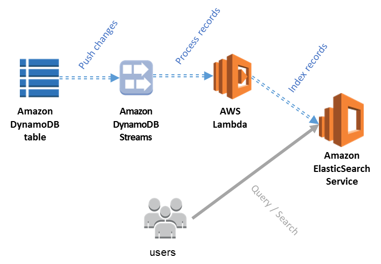

## Introduction
---
This section contains some hands-on labs and architectures from AWS Blogs that can help you familiarize with AWS data analytic services, having a better understanding about how different services integrate with other and the best practice of each.

## Table of Contents
---
- [Hands-on Labs](#Hands-on-Labs)
    - [Getting Started](#Getting-Started-🎒)
    - [Workshop and Labs](#Workshop-and-Labs-🎏 )
- [Architectures](#Architectures)

 ⬆️  &nbsp; <a href="./README.md">Back to the Main Page</a> 

## Hands-on Labs
---
### Getting Started 🎒
**Note:** pay attention to the options or configurations that you are not familar with and figure them later by checking the corresponding documentation
- [Getting Started with Amazon S3](https://docs.aws.amazon.com/AmazonS3/latest/userguide/GetStartedWithS3.html)

- [AWS Kinesis](https://aws.amazon.com/kinesis/)
    - [Getting Started with Amazon Kinesis Data Streams](https://docs.aws.amazon.com/streams/latest/dev/getting-started.html)
    - [Creating an Amazon Kinesis Data Firehose Delivery Stream](https://docs.aws.amazon.com/firehose/latest/dev/basic-create.html)
    - [Getting Started with Amazon Kinesis Data Analytics for SQL Applications](https://docs.aws.amazon.com/kinesisanalytics/latest/dev/getting-started.html)

- [Getting Started with AWS Athena](https://docs.aws.amazon.com/athena/latest/ug/getting-started.html)

- [Getting Started Using AWS Glue](https://docs.aws.amazon.com/glue/latest/dg/getting-started.html)

- [Getting started with Amazon EMR](https://docs.aws.amazon.com/emr/latest/ManagementGuide/emr-gs.html)

- [Getting Started with Amazon Redshift](https://docs.aws.amazon.com/redshift/latest/gsg/getting-started.html)

- [Getting Started with Amazon Elasticsearch Service](https://docs.aws.amazon.com/elasticsearch-service/latest/developerguide/es-gsg.html)

### Workshop and Labs 🎏 
- *Create real-time clickstream sessions and run analytics with Amazon Kinesis Data Analytics, AWS Glue, and Amazon Athena*: 
    - [URL to the blog](https://aws.amazon.com/blogs/big-data/create-real-time-clickstream-sessions-and-run-analytics-with-amazon-kinesis-data-analytics-aws-glue-and-amazon-athena/)
    - Architecture: 
    

- *Orchestrate Amazon Redshift-Based ETL workflows with AWS Step Functions and AWS Glue*
    - [URL to the blog](https://aws.amazon.com/blogs/big-data/orchestrate-amazon-redshift-based-etl-workflows-with-aws-step-functions-and-aws-glue/)
    - Architecture: 
    

- *Serverless Data Processing On AWS*: 
    - [URL to the workshop](https://data-processing.serverlessworkshops.io/)

- *Incremental Data Processing on Amazon EMR*
    - [URL to the workshop](https://incremental-data-processing-on-amazonemr.workshop.aws/en/)
    - Architecture: 
    

- *Automate Amazon Redshift cluster creation using AWS CloudFormation*
    - [URL to the blog](https://aws.amazon.com/blogs/big-data/automate-amazon-redshift-cluster-creation-using-aws-cloudformation/)
    - Architecture: 
    

## Architectures
---
**Note:** below are some blogs that demonstrate some real-life applications and integrations of AWS Big Data Services introduced above. It is better to read them after you have a basic understanding about the individual big data service. Also, many of the blogs include the step-by-step tutorial to help you go through the steps to replicate the results, which you can try out if interested.

*Visualize AWS Cloudtrail Logs Using AWS Glue and Amazon Quicksight:*
- [URL to the blog](https://noise.getoto.net/2017/11/10/visualize-aws-cloudtrail-logs-using-aws-glue-and-amazon-quicksight/)
- Architecture: 

*How to delete user data in an AWS data lake*
- [URL to the blog](https://aws.amazon.com/blogs/big-data/how-to-delete-user-data-in-an-aws-data-lake/)
- Architecture: 

*Configure and optimize performance of Amazon Athena federation with Amazon Redshift*
- [URL to the blog](https://aws.amazon.com/blogs/big-data/configure-and-optimize-performance-of-amazon-athena-federation-with-amazon-redshift/)
- Architecture: 

*Migrate and deploy your Apache Hive metastore on Amazon EMR*
- [URL to the blog](https://aws.amazon.com/blogs/big-data/migrate-and-deploy-your-apache-hive-metastore-on-amazon-emr/)
- Architecture: 

*Optimize Amazon EMR costs with idle checks and automatic resource termination using advanced Amazon CloudWatch metrics and AWS Lambda*
- [URL to the blog](https://aws.amazon.com/cn/blogs/big-data/optimize-amazon-emr-costs-with-idle-checks-and-automatic-resource-termination-using-advanced-amazon-cloudwatch-metrics-and-aws-lambda/)
- Architecture: 

*Indexing Amazon DynamoDB Content with Amazon Elasticsearch Service Using AWS Lambda*
- [URL to the blog](https://aws.amazon.com/blogs/compute/indexing-amazon-dynamodb-content-with-amazon-elasticsearch-service-using-aws-lambda/)
- Architecture: 
